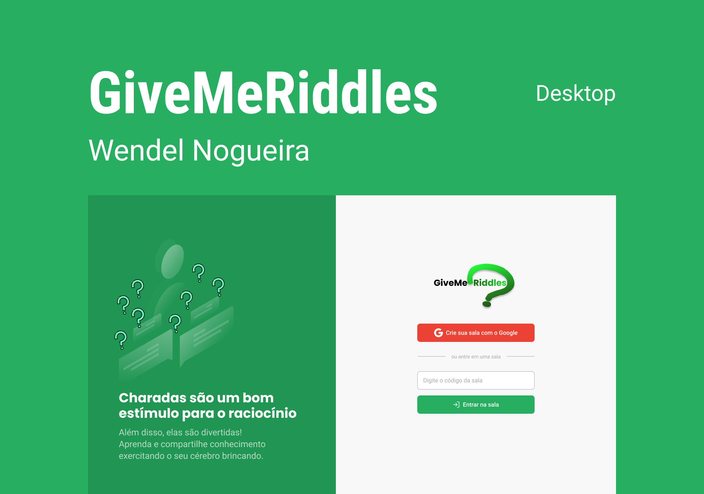

<p align="center">
  
</p>

# What is "GiveMeRiddles" ?

-  Is a "riddles and answers" app still in development. In it you have the admin side, where you can create rooms and let other people send you riddles, and the participant side, where you search for a room by code. After posting the riddle, participants can like the best riddle so that it climbs the ranking and is answered first by the admin. The idea came to me during Rocketseat's NLWTogether, where we built a quiz app from scratch called LetmeAsk.

# Design
The design was all based on the design that Rebecca Gonzalez created for LetmeAsk during the Next Level Week Together.

<p align="center">
  
</p>

# 🧪 Technologies
This project was developed using the following technologies:

* React
* Firebase
* TypeScript

# 🚀 Getting started
Clone the project and access the folder.
````
$ git clone https://github.com/WendelNogueira23/React-GiveMeRiddles.git
$ cd React-GiveMeRiddles
````
# Follow the steps below:
````
# Install the dependencies
$ yarn

# Start the project
$ yarn start
````
The app will be available for access on your browser at http://localhost:3000
